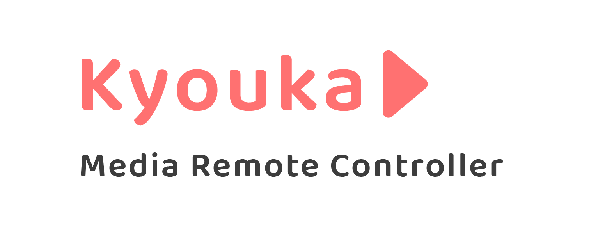

   

---

Source code of **Kyouka**, a web application build with **FastAPI** and **Vue.js** used to control Windows Media Key remotely using your mobile device.

 

## 🚧 Contributing

**You are more than welcome to help me improve Kyouka!**

Just fork this project from the `master` branch and submit a Pull Request (PR).

 

## 📃 License

This project is licensed under [GPL-3.0](https://choosealicense.com/licenses/gpl-3.0/) .
