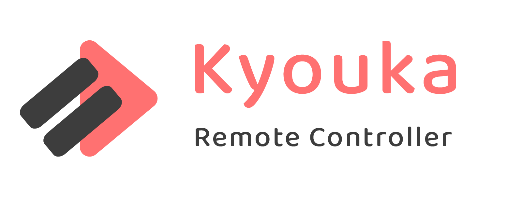

<p align="center">
  <br />
</p>

---

[](https://www.gnu.org/licenses/gpl-3.0)

**Kyouka** is a web application build with **FastAPI** and **Vue.js** used to control Windows Media Keys remotely using your smartphone or any browser.

> 💡 Currently tested only on Windows 10 machine, but should work on Linux too!

It allows you to control YouTube music playing *(Or any other player!)* from your desktop while in bed and away from the keyboard.  
How awesome is that!

<br>

<p align="center">
	
</p>

<br>

**Kyouka** is a single Python process running on your desktop that simulates keyboard media button presses and provides you with a web interface that can be accessed in your local network.

<br>

## 🔥 Getting Started

**It's easy to get started using Kyouka!**

This project uses **Python** as a backend language, so make sure you have It installed!

> 💡 Execute every command in the ./kyouka directory!

- Download `Kyouka_v1.x.x.zip` package from the **Releases** tab on the right and unpack It.

- Install all required dependencies by running this command against the provided `requirements.txt` file.

  ```bash
  python -m pip install -r requirements.txt
  ```

- Run `kyouka.py` file by clicking on It or if it doesn't work type:

  ```bash
  python kyouka.py
  ```

- **Done!** Now you can access the dashboard by entering your **desktop's IP** with default **7070** port.
  ```bash
  http://127.0.0.1:7070
  ```

<br>

## 🚧 Contributing

**You are more than welcome to help me improve Kyouka!**

Just fork this project from the `master` branch and submit a Pull Request (PR).

<br>

## 📃 License

This project is licensed under [GPL-3.0](https://choosealicense.com/licenses/gpl-3.0/) .
